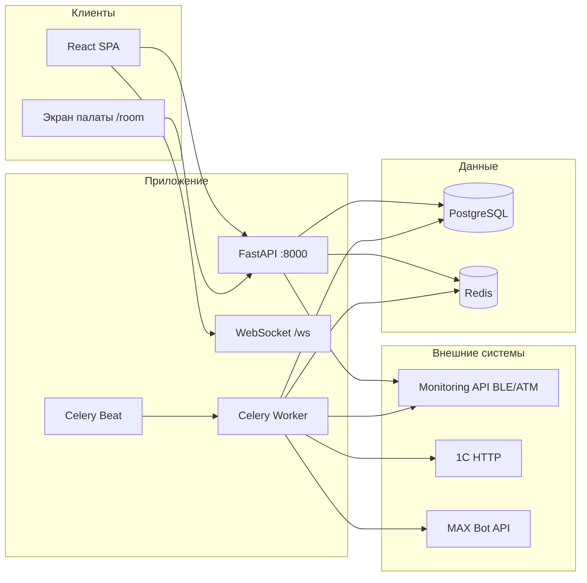

# Архитектура

## Назначение системы

Веб-приложение для стационара медицинского центра: учёт пациентов и коек, назначения, наблюдения, форма 530/н, мониторинг браслетов и атмосферы палат, оповещения в MAX, синхронизация с 1С.

## Компоненты



| Сервис | Технология | Роль |
|--------|------------|------|
| **frontend** | React 18, TypeScript, CRA | UI медсестры, врача, админа, экран палаты |
| **backend** | FastAPI, SQLAlchemy 2 | REST API, auth, бизнес-логика |
| **postgres** | PostgreSQL 15 | Основное хранилище |
| **redis** | Redis 7 | Celery broker/backend, дедуп алертов браслетов |
| **celery** | Celery | Фон: 1С, проверка виталов |
| **celery-beat** | Celery Beat | Расписание задач |

## Backend (слои)

```
app/
├── api/v1/endpoints/   # HTTP-роуты
├── crud/               # Запросы к БД
├── models/             # SQLAlchemy ORM
├── schemas/            # Pydantic (ответы/запросы)
├── services/           # Сложная логика (530н, мониторинг, пакеты назначений)
├── bracelet_alerts/    # Пороги, evaluator, MAX, привязка BLE
├── tasks/              # Celery tasks
└── core/               # config, security, database, websocket_manager
```

Миграции: **Alembic** (`backend/alembic/versions/`).

## Frontend (слои)

```
frontend/src/
├── pages/              # Login, NurseDashboard, DoctorDashboard, RoomDisplay
├── components/
│   ├── nurse-station/  # Пациенты, назначения, 530н, палаты
│   ├── doctor-station/ # Назначения, отчёты
│   ├── bracelet-monitoring/
│   ├── room-display/   # BedSchematic (публичный экран)
│   └── common/
├── hooks/              # useAuth, usePatients, useBraceletOverview, useWebSocket
├── services/api.ts     # Axios, единая точка API
└── utils/
```

Прокси в dev: `setupProxy.js` — `/api` → `http://localhost:8000`.

## Ключевые потоки данных

### Пациенты и койки

1. Импорт из 1С (Celery + ручной `POST /integration/1c/sync`) → таблицы `patients`, связь с `beds` / `rooms`.
2. Активные пациенты — `GET /patients/`.
3. Выписка — `PATCH /patients/{id}/archive` → статус `DISCHARGED`.

### Назначения

- Врач создаёт пакет: `POST /medical/prescriptions` или `batch`.
- Медсестра выполняет: `POST /medical/prescriptions/{id}/execute` → процедура/запись.
- WebSocket уведомляет станцию о новых/отменённых назначениях.

### Мониторинг палаты

- `GET /monitoring/dashboard?room_id=` — койки, BLE-метрики, атмосфера зоны.
- Публичный `/room` и вкладка «Палаты» медсестры используют один API (у публичного режима — без JWT при `ALLOW_PUBLIC_ROOM_DISPLAY=True`).

### Браслеты

- Обзор: `GET /bracelet-alerts/overview` (nurse/admin).
- Celery каждые N секунд: снимок виталов → сравнение с порогами → MAX (с cooldown в Redis).
- Пороги: глобальные defaults (`bracelet_alerts/thresholds.py`) + `patients.vital_threshold_overrides` (JSON).
- Привязка MAC: `assign-bracelet`, `distribute-bracelets`, блок непривязанных в UI.
- Подробнее: [BACKEND.md](./BACKEND.md) § bracelet_alerts.

### Экран палаты (публичный)

- Маршрут `/room` — без JWT при `ALLOW_PUBLIC_ROOM_DISPLAY=True`.
- v2 layout: карточки коек, 5 BLE-метрик, футер атмосферы; опрос 3 с.
- Legacy: `?legacy=1` — `BedSchematic`, тёмная тема.
- Подробнее: [ROOM_DISPLAY.md](./ROOM_DISPLAY.md).

## База данных (основные сущности)

| Сущность | Назначение |
|----------|------------|
| `users` | Врачи, медсестры, админы |
| `patients` | Пациенты, флаги палаты, BLE MAC, пороги |
| `rooms`, `beds` | Палаты и койки |
| `observations` | Наблюдения (температура, АД, …) |
| `prescriptions`, `prescription_packages` | Назначения |
| `procedures` | Выполнение процедур |

Подробная схема — [DATABASE.md](./DATABASE.md), миграции Alembic, Swagger-схемы.

## Realtime

- WebSocket: `/api/v1/ws/{room_id}?token=...` (JWT в query).
- События: создание/отмена/выполнение назначений (см. `websocket_manager`).

## Безопасность (кратко)

- JWT Bearer для защищённых endpoint'ов.
- Роль в токене/профиле: `admin`, `nurse`, `doctor`.
- Публичный режим только для выбранных read-only endpoint'ов (палаты, список активных пациентов на дисплее).

См. [ROLES_AND_AUTH.md](./ROLES_AND_AUTH.md).
