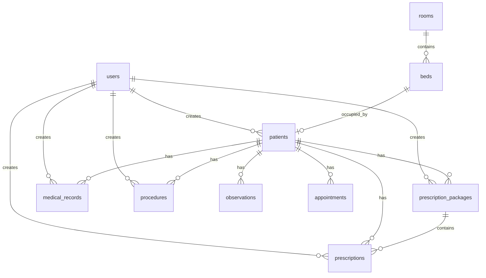

# База данных

PostgreSQL 15. ORM — SQLAlchemy 2. Миграции — Alembic (`backend/alembic/versions/`).

При старте backend в Docker выполняется `alembic upgrade head`.

---

## ER-диаграмма (основные сущности)



---

## Таблицы

### `users`

Пользователи системы (врачи, медсестры, админы).

| Поле | Тип | Описание |
|------|-----|----------|
| `id` | int PK | |
| `username` | string | Уникальный логин |
| `email` | string | |
| `hashed_password` | string | bcrypt |
| `full_name` | string | ФИО |
| `role` | enum | `admin`, `nurse`, `doctor` |
| `is_active` | bool | |
| `created_at`, `updated_at` | datetime | Из `BaseModel` |

### `patients`

| Поле | Тип | Описание |
|------|-----|----------|
| `id` | int PK | |
| `external_id` | string | Уникальный ID из 1С |
| `full_name` | string | ФИО |
| `birth_date` | datetime | |
| `gender` | string | |
| `medical_record_number` | string | Номер истории |
| `admission_date` | datetime | Дата поступления |
| `discharge_date` | datetime | Дата выписки |
| `status` | enum | `ACTIVE`, `DISCHARGED` |
| `bed_id` | FK → beds | Текущая койка |
| `created_by` | FK → users | |
| `document_id`, `branch_id` | string | Поля из 1С |
| `department_id`, `department_name` | string | Подразделение |
| `ble_mac` | string | MAC браслета (без двоеточий) |
| `vital_threshold_overrides` | JSON | Персональные пороги виталов |
| `flag_white` … `flag_green` | bool | Статусы на экране палаты |

**Флажки пациента** (не путать с ролями пользователя):

| Поле | Смысл в UI |
|------|------------|
| `flag_white` | Всё в порядке |
| `flag_yellow` | Риск падения |
| `flag_orange` | Инфекция |
| `flag_red` | Аллергия |
| `flag_green` | Диета |

### `rooms`

| Поле | Тип | Описание |
|------|-----|----------|
| `id` | int PK | |
| `number` | string | Номер палаты |
| `name`, `description` | string | |
| `max_beds` | int | |
| `floor`, `wing` | int/string | |
| `external_id` | string | UUID из 1С |
| `monitor_zone` | int | Зона ATM API (1–3) для атмосферы |

### `beds`

| Поле | Тип | Описание |
|------|-----|----------|
| `id` | int PK | |
| `number` | string | Номер койки |
| `room_id` | FK → rooms | |
| `is_occupied` | bool | |
| `external_id` | string | ID из 1С |

Койки на экране палаты берутся **только из 1С** (`activeRoom.beds`), без фиктивных записей.

### `medical_records` / наблюдения

Записи показателей (температура, АД, пульс, SpO₂ и т.д.) за дату. Используются в форме 530/н и карточке пациента.

Ключевые поля: `record_date`, `temperature`, `blood_pressure_systolic/diastolic`, `pulse`, `respiration_rate`, `spO2`, `weight`, `height`, `complaints`, `examination`, `diagnosis`, `recommendations`, `created_by`.

### `prescription_packages`

Пакет назначений от врача (группа процедур/измерений + общие примечания).

| Поле | Описание |
|------|----------|
| `status` | `ACTIVE`, `COMPLETED` |
| `general_notes` | Общий комментарий |
| `completed_at` | Когда пакет закрыт |

### `prescriptions`

Отдельное назначение внутри пакета.

| Поле | Описание |
|------|----------|
| `type` | `PROCEDURE`, `MEASUREMENT`, `NOTE` |
| `status` | `ACTIVE`, `COMPLETED`, `CANCELLED` |
| `name`, `description` | Название и детали |
| `frequency`, `dosage`, `duration` | Режим |
| `package_id` | FK → prescription_packages |
| `completed_at` | Время выполнения |

### `procedures`

Выполненные процедуры (создаются при `execute` назначения).

### `appointments`

Записи на приём / осмотр (legacy-совместимость с более ранней моделью).

---

## Миграции Alembic

Каталог: `backend/alembic/versions/`.

| Миграция (пример) | Содержание |
|-------------------|------------|
| `75346d6baa10` | Начальные таблицы |
| `*_add_rooms_and_beds` | Палаты и койки |
| `b2c3d4e5f6a7` | Поля мониторинга (`ble_mac`, `monitor_zone`) |
| `d4e5f6a7b8c9` | Флажки пациента |
| `e5f6a7b8c9d0` | Пакеты назначений |
| `f6a7b8c9d0e1` | `vital_threshold_overrides` |
| `c3d4e5f6a7b8` | Зоны мониторинга для палат |

### Команды

```bash
# Применить все миграции
cd backend && alembic upgrade head

# В Docker
docker compose exec backend alembic upgrade head

# Создать новую миграцию (после изменения models/)
alembic revision --autogenerate -m "описание"
```

---

## Redis (не PostgreSQL, но связан)

| DB index | Назначение |
|----------|------------|
| 0 | `REDIS_URL` — общий (dedup алертов) |
| 1 | Celery broker |
| 2 | Celery result backend |

Ключи cooldown алертов браслетов хранятся в Redis (`bracelet_alerts/dedup_store.py`).

---

## Связанные документы

- [ARCHITECTURE.md](./ARCHITECTURE.md) — потоки данных
- [BACKEND.md](./BACKEND.md) — CRUD и модели в коде
- [SETUP.md](./SETUP.md) — подключение к БД локально
