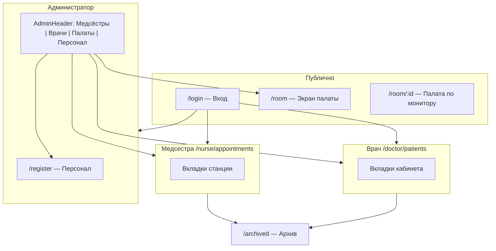

# Карта сайта — Med Center Dashboard

Документ для дизайнера и UX: структура экранов, роли, URL и вложенные состояния (вкладки, модалки).  
Приложение — SPA (React), часть навигации **без смены URL** (вкладки внутри кабинетов).

**Визуальная карта (как Pinterest sitemap):** откройте в браузере [proposed-redesign-sitemap.html](./proposed-redesign-sitemap.html) — нумерация экранов, легенда, ветки ролей и модалок.

> Остальная документация: [README.md](./README.md) (индекс), [ARCHITECTURE.md](./ARCHITECTURE.md), [SETUP.md](./SETUP.md).

---

## Роли и точки входа

| Роль | После входа | Основной URL |
|------|-------------|--------------|
| **Гость** | — | `/login` |
| **Медсестра** | Станция медсестры | `/nurse/appointments` |
| **Врач** | Кабинет врача | `/doctor/patients` |
| **Администратор** | Регистрация персонала | `/register` + верхняя панель на всех защищённых страницах |

---

## Карта URL (маршруты)

```
/                          → редирект на /login
/login                     → Вход
/register                  → Админ: персонал (только admin)
/nurse/appointments        → Станция медсестры (admin, nurse)
/doctor/patients           → Кабинет врача (admin, doctor)
/archived                  → Архив пациентов (admin, nurse, doctor)
/room                      → Публичный экран палаты (без входа)
/room/:monitorId           → Экран палаты для конкретного монитора
/dashboard                 → редирект на /register
```

### Deep-link (query-параметры)

Вкладки и вложенные состояния синхронизируются с URL. После F5 или при копировании ссылки открывается тот же экран.

| Параметр | Где используется | Пример |
|----------|------------------|--------|
| `tab` | Медсестра, врач | `?tab=bracelets` |
| `patient` | Выбранный пациент (назначения, 530н, отчёты) | `?tab=appointments&patient=12` |
| `card` | Открытая карточка пациента (модалка) | `?tab=patients&card=12` |
| `cardTab` | Вкладка внутри карточки | `?card=12&cardTab=prescriptions` |
| `subtab` | Подвкладки (форма назначений врача) | `?tab=prescriptions&subtab=measurements` |
| `report` | Раскрытый отчёт врача | `?tab=reports&report=form530n` |
| `room` | Палата на `/room` (тестовый режим) | `/room?room=2` |
| `legacy` | Старый макет палаты | `/room?legacy=1` |

**Примеры:**

- Медсестра → браслеты: `/nurse/appointments?tab=bracelets`
- Медсестра → назначения пациента: `/nurse/appointments?tab=appointments&patient=5`
- Врач → назначения: `/doctor/patients?tab=prescriptions&patient=5&subtab=procedures`
- Карточка пациента: `/nurse/appointments?tab=patients&card=5&cardTab=observations`
- Архив с картой: `/archived?card=9`

---

## Общая схема (Mermaid)



---

## 1. Вход `/login`

- Форма: логин, пароль
- Ошибка авторизации
- Состояние загрузки
- Редирект по роли после успеха

**Без** общего хедера приложения (отдельный layout).

---

## 2. Администратор

### 2.1 Верхняя панель `AdminHeader` (на всех защищённых страницах, только role=admin)

| Пункт | Переход |
|-------|---------|
| Логотип | `/register` |
| Медсёстры | `/nurse/appointments` |
| Врачи | `/doctor/patients` |
| Палаты | `/room` (публичный дисплей) |
| Персонал | `/register` |
| Выход | `/login` |

### 2.2 Персонал `/register`

- Форма регистрации пользователя (роль: врач / медсестра)
- Таблица / список существующих пользователей
- Сообщения успеха / ошибки

---

## 3. Станция медсестры `/nurse/appointments`

**Шапка:** название станции, дата/время, счётчик пациентов.

**Горизонтальные вкладки** (один URL):

| # | Вкладка | Содержимое |
|---|---------|------------|
| 1 | **Пациенты** | Список карточек активных пациентов |
| 2 | **Наблюдения** | Таблица наблюдений + выбор пациента |
| 3 | **Форма 530н** | Лист 530/н, период, печать, ручной ввод |
| 4 | **Назначения** | Список пациентов + лист назначений (выполнение) |
| 5 | **Браслеты** | Мониторинг BLE, алерты, непривязанные устройства |
| 6 | **Архив** | Выписанные пациенты (карточки) |
| 7 | **Палаты** | Монитор палаты (без схемы-картинки): койки, статусы-флажки с подписями, назначения по клику |

### 3.1 Пациенты

- Список карточек (палата, койка, дата поступления)
- Кнопки: **Выбрать**, **Карта**
- **Модалка:** карточка пациента (см. § Модалки)

### 3.2 Наблюдения

- Фильтр / выбор пациента
- Таблица записей наблюдений

### 3.3 Форма 530н

- Выбор пациента, период (С / По), 7 / 14 дней
- Кнопки: обновить, ручной ввод, + строка, сохранить, печать
- Превью таблицы показателей
- Боковые блоки: активные назначения, процедуры за период

### 3.4 Назначения

- **Колонка 1:** список пациентов
- **Колонка 2:** назначения выбранного пациента
  - Фильтры: все / активные / выполненные / отменённые
  - Массовое подтверждение выполнения
  - Раскрытие деталей назначения
  - Отмена активного назначения

### 3.5 Браслеты

- Панель инструментов: обновить, проверка, тест MAX
- Фильтры: все / с алертами / без MAC
- Карточки пациентов с показателями и порогами
- Блок непривязанных браслетов
- **Модалка:** настройка порогов виталов

### 3.6 Архив (вкладка)

- Сетка карточек выписанных
- Кнопки: **Карта**, **Вернуть** (восстановление в активные)
- **Модалка:** карточка пациента (только просмотр)

### 3.7 Палаты (вкладка) — `NurseRoomMonitor`

- Выбор палаты, статус мониторинга, обновление
- Сводка: коек / занято / свободно
- Атмосфера палаты (4 показателя)
- **Сетка коек:** схема койки, ФИО, метрики браслета, флажки
- **Правая панель** (при выборе занятой койки):
  - Заголовок: койка + пациент
  - Встроенный лист назначений (режим panel, без списка пациентов)

---

## 4. Кабинет врача `/doctor/patients`

**Шапка:** заголовок, дата, число пациентов (белый текст на тёмном фоне).

**Навигация** (один URL):

| # | Вкладка | Содержимое |
|---|---------|------------|
| 1 | **Обзор** | KPI-карточки, мини-список последних пациентов |
| 2 | **Пациенты** | Сетка карточек активных пациентов |
| 3 | **Назначения** | Создание назначений + список по пациенту |
| 4 | **Отчёты** | 4 типа отчётов с раскрывающимися блоками |
| 5 | **Архив** | Архив выписанных (как у медсестры) |

### 4.1 Обзор

- Карточки статистики (активные, ожидают осмотра, назначения сегодня, к выписке, выполнено)
- Блок «Последние пациенты» → переход на вкладку Пациенты
- Состояния: загрузка, ошибка

### 4.2 Пациенты

- Карточки: ФИО, койка, палата, поступление, подразделение
- Кнопки: **Назначения** (→ вкладка Назначения с выбранным пациентом), **Карта** (модалка)
- Клик по карточке не открывает модалку (только кнопки)

### 4.3 Назначения

- **Форма создания** (2 подвкладки: Процедуры | Измерения)
  - Выбор пациента
  - Чекбоксы процедур/измерений, частота, примечания
  - Общие примечания, отправка
- **Список назначений пациента** (при выборе patientId)
- Компактный список пакетов назначений справа

### 4.4 Отчёты — `DoctorReportsView`

| Карточка | Раскрываемый блок |
|----------|-------------------|
| Статистика по пациентам | Сетка показателей + экспорт CSV |
| Статистика по назначениям | Статусы, типы, % выполнения + CSV |
| Форма 530н | Выбор пациента (активные + архив) + встроенная форма 530н |
| Отчёт по отделению | Таблица подразделений + CSV |

### 4.5 Архив

- Тот же компонент `ArchivedPatientsPanel`, что у медсестры

---

## 5. Архив `/archived`

Отдельный маршрут (дублирует вкладку «Архив» в кабинетах):

- Список / карточки выписанных
- Карта пациента (модалка, read-only)
- Вернуть из архива

---

## 6. Публичный экран палаты `/room`, `/room/:monitorId`

**Без авторизации.** Fullscreen.

> Подробная спецификация v2: [ROOM_DISPLAY.md](./ROOM_DISPLAY.md).  
> Legacy-макет: `?legacy=1` (тёмная тема, `BedSchematic`, атмосфера сбоку).

### v2 (по умолчанию) — светлый макет

| Зона | Элементы |
|------|----------|
| Шапка | Логотип, № палаты, время, индикатор связи |
| Селектор | Выбор палаты (если нет `monitorId`) |
| Список коек | Карточки 1000×475: флажки слева, аватар `chelik.png`, 5 метрик браслета |
| Футер | Атмосфера: температура, влажность, давление (3 карточки) |

**Метрики на койке:** температура (`temp-chel`), пульс, арт. давление, SpO₂, сон.

**Флажки:** только активные, колонка у верхнего края аватара (22 px от верха).

**Нет:** назначений, редактирования, модалок.

### Legacy (`?legacy=1`)

| Зона | Элементы |
|------|----------|
| Шапка | Логотип, № палаты, время, индикатор связи |
| Основная колонка | Вертикальные полосы коек: `BedSchematic` + метрики |
| Боковая колонка | Атмосфера (temp, hum, press, co2) |

---

## Модальные окна и оверлеи

| Где открывается | Модалка | Назначение |
|-----------------|---------|------------|
| Пациенты (медсестра) | `PatientCard` | Полная карта: инфо, наблюдения, процедуры, измерения, пакеты назначений, статусы, браслет |
| Врач → Пациенты | `PatientCard` | То же |
| Архив | `PatientCard` (read-only) | Просмотр без выписки/редактирования |
| Карточка пациента → Назначения | `PrescriptionPackageModal` | Детали пакета назначений |
| Браслеты | `PatientVitalThresholdsModal` | Пороги виталов |
| Назначения врача | `PrescriptionPackageModal` | Детали пакета |
| Toast | `NotificationToast` | Уведомления (новые назначения и др.) |

### Вкладки внутри `PatientCard`

1. Наблюдения  
2. Процедуры  
3. Измерения  
4. Назначения (пакеты)  
5. Статусы (флажки на экран палаты) — скрыто в архиве  
6. Браслет (пороги) — скрыто в архиве  

Левая колонка: данные пациента, **Редактировать**, **Выписать** (скрыто в архиве).

---

## Сравнение: экран палаты vs палаты медсестры

| | `/room` (дисплей) | Вкладка «Палаты» медсестры |
|--|-------------------|----------------------------|
| Аудитория | Монитор в палате | Медсестра |
| Авторизация | Нет | Да |
| Назначения | Нет | Да, по клику на койку |
| Плотность UI | Крупно, на расстоянии | Рабочий интерфейс + боковая панель |
| Обновление | ~3 с | ~4 с |

---

## Ключевые компоненты (для handoff в Figma)

| Компонент | Файл / область |
|-----------|----------------|
| Карточка пациента (список) | `PatientList.css` |
| Карточка пациента (модалка) | `PatientCard.css` |
| Схема койки | `BedSchematic` |
| Лист назначений | `AppointmentsView.css` |
| Форма 530н | `MedicalForm530n.css` |
| Монитор палат (медсестра) | `NurseRoomMonitor.css` |
| Экран палаты v2 | `RoomDisplayPageV2.css` |
| Экран палаты legacy | `RoomDisplayPage.css`, `BedSchematic` |
| Браслеты | `bracelet-monitoring/*` |
| Кабинет врача | `DoctorDashboardPage.css` |
| Отчёты врача | `DoctorReportsView.css` |

---

## Рекомендации для дизайна

1. **Два визуальных языка:** рабочие кабинеты (светлый, зелёный акцент медсестры / синий врач) и **fullscreen палата v2** (светлый, крупная типографика, карточки с тенью). Legacy палата — тёмная тема.
2. **Вкладки в URL** — в прототипе можно подписать примеры ссылок (`?tab=…`) для handoff разработчикам.
3. **Модалки** — единый паттерн overlay; карта пациента — самый сложный экран (2 колонки + 6 вкладок).
4. **Пустые состояния:** нет пациентов, нет назначений, койка свободна, архив пуст, мониторинг offline.
5. **Адаптив:** палаты медсестры и назначения — колонка на `<1100px`; публичный `/room` — Full HD landscape.

---

*Версия структуры: актуально на июнь 2026. При добавлении маршрутов обновляйте этот файл.*
